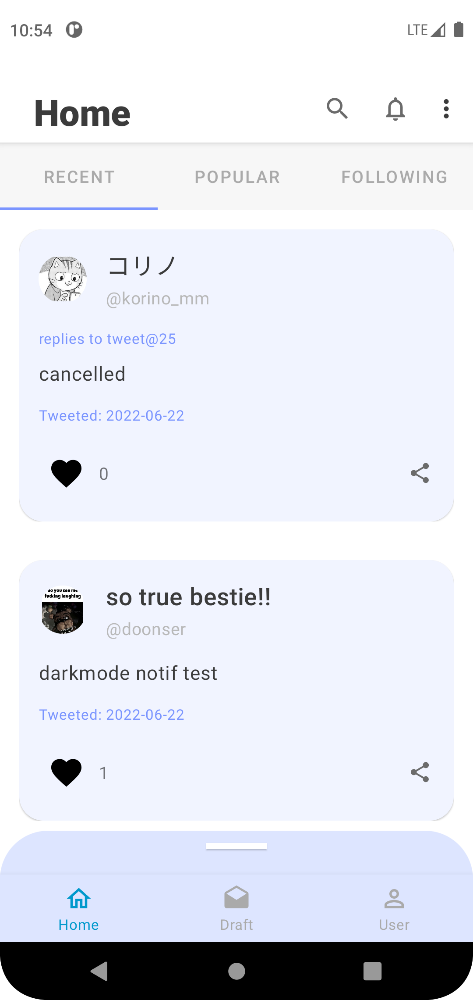
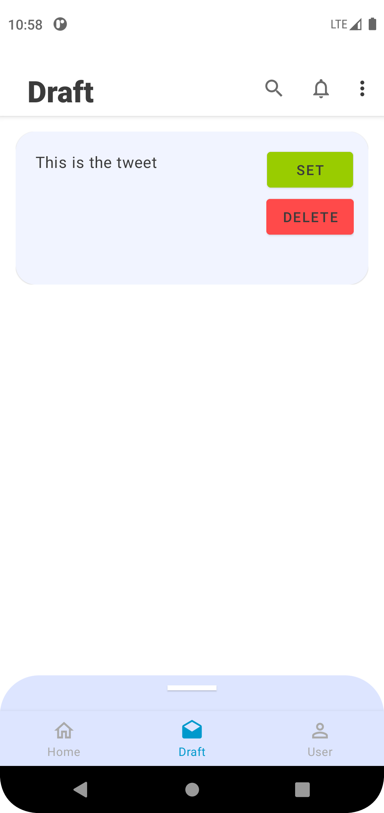
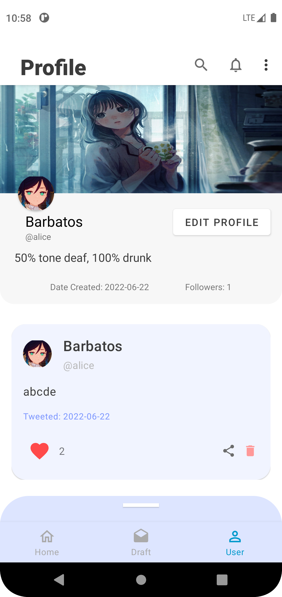
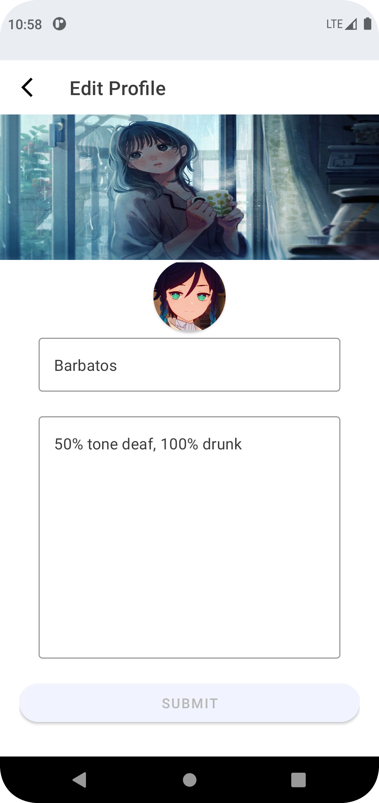
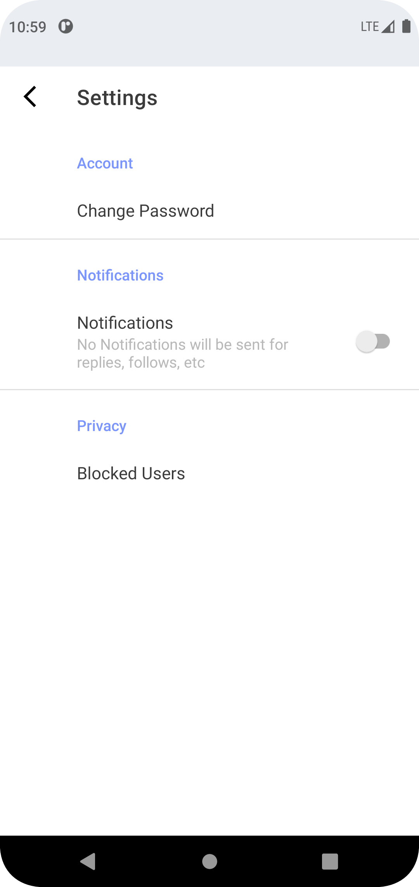

# anyApp

Simple Discussion Forum for Android with [Django backend](https://github.com/sogood99/anyApp-backend).

## Screenshots

### Home Page

  

### Tweet Bottom Sheet

  

### Draft Page

  

### Profile Page

  

### Edit Profile Page

  

### Settings Page

  

